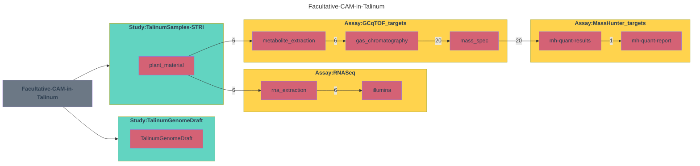

# Facultative CAM in Talinum

This ARC is based on Brilhaus et al. (2016). <https://doi.org/10.1104/pp.15.01076>. See [isa.investigation.xlsx](./isa.investigation.xlsx) for details.
The [Talinum Genome Draft](./studies/TalinumGenomeDraft) originates from <https://git.nfdi4plants.org/hhu-plant-biochemistry/talinum-fruticosum-genome>

## Table of Contents

- [Table of Contents](#table-of-contents)
  - [Description](#description)
- [Relationships between Assays and Studies](#relationships-between-assays-and-studies)
- [Workflow Overview](#workflow-overview)
- [Additional details](#additional-details)
- [Publication](#publication)
- [Study : *TalinumGenomeDraft*](#study--talinumgenomedraft)
  - [Additional details](#additional-details-1)
  - [Annotation headers](#annotation-headers)
- [Study : *TalinumSamples-STRI*](#study--talinumsamples-stri)
  - [Additional details](#additional-details-2)
  - [Annotation headers](#annotation-headers-1)
- [Assay : *MassHunter\_targets*](#assay--masshunter_targets)
  - [Additional details](#additional-details-3)
  - [Annotation headers](#annotation-headers-2)
- [Assay : *RNASeq*](#assay--rnaseq)
  - [Additional details](#additional-details-4)
  - [Annotation headers](#annotation-headers-3)
- [Assay : *GCqTOF\_targets*](#assay--gcqtof_targets)
  - [Additional details](#additional-details-5)
  - [Annotation headers](#annotation-headers-4)

### Description

Drought tolerance is a key factor for agriculture in the 21st century as it is a major determinant of plant survival in natural ecosystems as well as crop productivity. Plants have evolved a range of mechanisms to cope with drought, including a specialized type of photosynthesis termed Crassulacean acid metabolism (CAM). CAM is associated with stomatal closure during the day as atmospheric CO2 is assimilated primarily during the night, thus reducing transpirational water loss. The tropical herbaceous perennial species Talinum triangulare is capable of transitioning, in a facultative, reversible manner, from C3 photosynthesis to weakly expressed CAM in response to drought stress. The transcriptional regulation of this transition has been studied. Combining mRNA-Seq with targeted metabolite measurements, we found highly elevated levels of CAM-cycle enzyme transcripts and their metabolic products in T. triangulare leaves upon water deprivation. The carbohydrate metabolism is rewired to reduce the use of reserves for growth to support the CAM-cycle and the synthesis of compatible solutes. This large-scale expression dataset of drought-induced CAM demonstrates transcriptional regulation of the C3–CAM transition. We identified candidate transcription factors to mediate this photosynthetic plasticity, which may contribute in the future to the design of more drought-tolerant crops via engineered CAM.

## Relationships between Assays and Studies

## Workflow Overview

## Additional details

| Meta Data | Description |
| --------- | ----------- |
| Submission Date | July 07, 2015 |
| Public Release Date | Nov 05, 2015 |
| Study identifiers | TalinumGenomeDraft , TalinumSamples-STRI |
| Study Count | 2 |
| Assay identifiers | MassHunter_targets , RNASeq , GCqTOF_targets |
| Assay Count | 3 |

## Publication

| Meta Data | Description |
| ----------- | ----------- |
| Title | Reversible Burst of Transcriptional Changes during Induction of Crassulacean Acid Metabolism in Talinum triangulare. |
| Authors | Brilhaus, Dominik; Bräutigam, Andrea; Mettler-Altmann, Tabea; Winter, Klaus; Weber, Andreas P M |
| PubMedID | 26530316 |
| DOI | 10.1104/pp.15.01076 |
| Current status | Published |

## Study : *TalinumGenomeDraft*

### Additional details

| Meta Data | Description |
| --------- | ----------- |
| Table Count | 1 |
| Table Names | TalinumGenomeDraft |
| Sample Count | 1 |
| Data File Count | 1 |
| Associated assays |  |
| Biological replicates | 0 |

### Annotation headers

## Study : *TalinumSamples-STRI*

### Additional details

| Meta Data | Description |
| --------- | ----------- |
| Table Count | 1 |
| Table Names | plant_material |
| Sample Count | 6 |
| Data File Count | 0 |
| Associated assays | RNASeq , GCqTOF_targets |
| Biological replicates | 0 |

### Annotation headers

**Characteristics**: [organism](https://bioregistry.io/OBI:0100026),[organism part](https://bioregistry.io/EFO:0000635),[plant age](http://purl.org/nfdi4plants/ontology/dpbo/DPBO_0000033)

**Parameters**: [growth day length](http://purl.org/nfdi4plants/ontology/dpbo/DPBO_0000041),[light intensity exposure](https://bioregistry.io/PECO:0007224),[humidity day](http://purl.org/nfdi4plants/ontology/dpbo/DPBO_0000005),[temperature day](http://purl.org/nfdi4plants/ontology/dpbo/DPBO_0000007),[temperature night](http://purl.org/nfdi4plants/ontology/dpbo/DPBO_0000008)

**Factors**: [watering exposure](https://bioregistry.io/PECO:0007383),[Timepoint](https://bioregistry.io/NCIT:C68568),`timepoint-ZT`,`Photosynthesis mode`

## Assay : *MassHunter_targets*

### Additional details

| Meta Data | Description |
| --------- | ----------- |
| Table Count | 2 |
| Table Names | mh-quant-results , mh-quant-report |
| Sample Count | 20 |
| Data File Count | 21 |
| Associated studies |  |

### Annotation headers

## Assay : *RNASeq*

### Additional details

| Meta Data | Description |
| --------- | ----------- |
| Measurement Type | mRNA Sequencing |
| Technology Type | Next Generation Sequencing |
| Table Count | 2 |
| Table Names | rna_extraction , illumina |
| Sample Count | 6 |
| Data File Count | 6 |
| Associated studies | TalinumSamples-STRI |

### Annotation headers

**Parameters**: [biosource amount](http://purl.org/nfdi4plants/ontology/dpbo/DPBO_0000013),[extraction method](http://purl.org/nfdi4plants/ontology/dpbo/DPBO_0000054),[extraction buffer](http://purl.org/nfdi4plants/ontology/dpbo/DPBO_0000050),[extraction buffer volume](http://purl.org/nfdi4plants/ontology/dpbo/DPBO_0000051),[RNA quality check](http://purl.org/nfdi4plants/ontology/dpbo/DPBO_0000062),[library strategy](http://purl.org/nfdi4plants/ontology/dpbo/DPBO_0000035),[library selection](http://purl.org/nfdi4plants/ontology/dpbo/DPBO_0000036),[library layout](http://purl.org/nfdi4plants/ontology/dpbo/DPBO_0000015),[library preparation kit](http://purl.obolibrary.org/obo/GENEPIO_0000085),[library preparation kit version](http://purl.obolibrary.org/obo/GENEPIO_0000149),[adapter sequence](http://purl.obolibrary.org/obo/GENEPIO_0000083),[next generation sequencing instrument model](http://purl.org/nfdi4plants/ontology/dpbo/DPBO_0000040),[base-calling software](http://purl.org/nfdi4plants/ontology/dpbo/DPBO_0000017),[base-calling software version](http://purl.org/nfdi4plants/ontology/dpbo/DPBO_0000018),[Raw data file format](http://purl.org/nfdi4plants/ontology/dpbo/DPBO_0000021)

## Assay : *GCqTOF_targets*

### Additional details

| Meta Data | Description |
| --------- | ----------- |
| Measurement Type | GCqTOF targeted |
| Table Count | 3 |
| Table Names | metabolite_extraction , gas_chromatography , mass_spec |
| Sample Count | 20 |
| Data File Count | 20 |
| Associated studies | TalinumSamples-STRI |

### Annotation headers

**Parameters**: [Bio entity](http://purl.org/nfdi4plants/ontology/dpbo/DPBO_0000012),[Biosource amount](http://purl.org/nfdi4plants/ontology/dpbo/DPBO_0000013),[Biosource material state](http://purl.org/nfdi4plants/ontology/dpbo/DPBO_0010009),[Extraction buffer](http://purl.org/nfdi4plants/ontology/dpbo/DPBO_0000050),[Extraction buffer volume](http://purl.org/nfdi4plants/ontology/dpbo/DPBO_0000051),[Internal standard](http://purl.org/nfdi4plants/ontology/dpbo/DPBO_0010012),[Sample volume](http://purl.org/nfdi4plants/ontology/dpbo/DPBO_0010013),[MS sample post-extraction](http://purl.org/nfdi4plants/ontology/dpbo/DPBO_0000043),[MS sample resuspension](http://purl.org/nfdi4plants/ontology/dpbo/DPBO_0000044),[MS derivatization](http://purl.org/nfdi4plants/ontology/dpbo/DPBO_0000052),[MS sample type](http://purl.org/nfdi4plants/ontology/dpbo/DPBO_0000045),[Chromatography instrument model](http://purl.org/nfdi4plants/ontology/dpbo/DPBO_0000046),[Chromatography autosampler model](http://purl.org/nfdi4plants/ontology/dpbo/DPBO_0000047),[Chromatography column type](http://purl.org/nfdi4plants/ontology/dpbo/DPBO_0000053),[Chromatography column model](http://purl.org/nfdi4plants/ontology/dpbo/DPBO_0000048),[mobile phase](http://purl.obolibrary.org/obo/CHMO_0000995),[Chromatography injection volume](http://purl.org/nfdi4plants/ontology/dpbo/DPBO_0010014),[Chromatography injection mode](http://purl.org/nfdi4plants/ontology/dpbo/DPBO_0010015),[Chromatography gradient](http://purl.org/nfdi4plants/ontology/dpbo/DPBO_0000081),[scan polarity](https://www.ebi.ac.uk/ols4/ontologies/ms/classes/http%253A%252F%252Fpurl.obolibrary.org%252Fobo%252FMS_1000465),[scan window lower limit](https://www.ebi.ac.uk/ols4/ontologies/ms/classes/http%253A%252F%252Fpurl.obolibrary.org%252Fobo%252FMS_1000501),[scan window upper limit](https://www.ebi.ac.uk/ols4/ontologies/ms/classes/http%253A%252F%252Fpurl.obolibrary.org%252Fobo%252FMS_1000500),[scan rate](https://www.ebi.ac.uk/ols4/ontologies/ms/classes/http%253A%252F%252Fpurl.obolibrary.org%252Fobo%252FMS_1000015),[instrument model](https://www.ebi.ac.uk/ols4/ontologies/ms/classes/http%253A%252F%252Fpurl.obolibrary.org%252Fobo%252FMS_1000031),[ionization type](https://www.ebi.ac.uk/ols4/ontologies/ms/classes/http%253A%252F%252Fpurl.obolibrary.org%252Fobo%252FMS_1000008),[mass analyzer type](https://www.ebi.ac.uk/ols4/ontologies/ms/classes/http%253A%252F%252Fpurl.obolibrary.org%252Fobo%252FMS_1000443),[detector type](https://www.ebi.ac.uk/ols4/ontologies/ms/classes/http%253A%252F%252Fpurl.obolibrary.org%252Fobo%252FMS_1000026)
